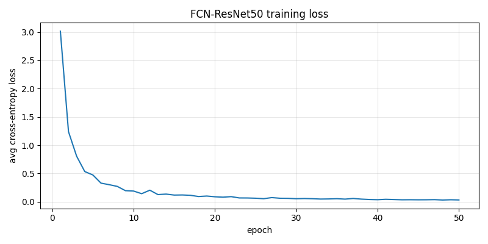

# Assignment 4: Image Segmentation

**Course:** CS 4391, Spring 2026
**Author:** Han Nguyen

This report covers two segmentation approaches applied to a Pascal VOC subset:
1. **K-means clustering** (unsupervised, color based) with K = 4.
2. **FCN** (Fully Convolutional Network) with a pretrained ResNet-50 backbone (supervised, learned).

All code lives in `main.py`. Result images are under `results/`. A separate `verify.py` confirms the dataset is in standard Pascal VOC indexed mask format before any training begins.

---

## 1. Dataset

* **Source:** subset of Pascal VOC 2011/2012.
* **Train:** 20 image and mask pairs in `segmentation_data/`.
* **Test:** 10 image and mask pairs in `segmentation_data/testing-dataset/`.
* **Mask format:** indexed PNGs (PIL mode `P`) where each pixel's integer is the VOC class ID. Value `0` is background, values `1` through `20` are the 20 VOC object classes (aeroplane, bicycle, and so on through tvmonitor). Value `255` marks a boundary or "ignore" pixel and is excluded from both the training loss and the evaluation metrics.
* **Class coverage in this subset:**
    * Train classes present: `{0, 1, 3, 4, 5, 6, 7, 9, 13, 14, 15, 16, 18, 20}`.
    * Test classes present: `{0, 1, 3, 8, 9, 10, 15, 18, 19}`.
    * Classes in test but not in train: `8 (cat)`, `10 (cow)`, `19 (train)`. The learned model has no way to predict these, so they remain a hard ceiling on achievable score.

The function `verify_voc_dataset` in `main.py` (and the standalone `verify.py`) confirms every mask PNG is mode `P`, its embedded palette matches the canonical VOC palette, and all pixel values lie within `{0..20, 255}`.

---

## 2. Task 1: K-Means Clustering

### Method

* **Color space:** RGB, scaled to `[0, 1]`.
* **K = 4** clusters.
* **Implementation:** vanilla K-means written from scratch in NumPy (no scikit-learn). The algorithm picks K random pixels as initial centers, assigns each pixel to the nearest center by squared L2 distance, recomputes each center as the mean of its assigned pixels, and repeats until center movement falls below 1e-3 or after 30 iterations.
* **Two random seeds: 0 and 42** are run independently per image to expose initialization sensitivity.
* Each pixel is recolored with the mean RGB of its assigned cluster. The resulting "posterized" image is the segmentation.

### Sample results

A three panel figure (original, seed 0, seed 42) is saved for every image in `results/task1_kmeans/<id>/comparison.png`.

| Image | Notes |
|---|---|
| `results/task1_kmeans/2011_002515/comparison.png` | Aeroplane scene. The plane body becomes its own cluster, snow and sky merge, dark equipment groups together. |
| `results/task1_kmeans/2011_000006/comparison.png` | People on couch. The yellow couch is isolated and dark jackets group with shadows. |
| `results/task1_kmeans/2011_002730/comparison.png` | Horse on field. Sky, trees, field, and horse are cleanly split by color. |

### Observations on initialization sensitivity

On most of these 30 images both seeds converge to very similar clusterings because the dominant color modes are strong and well separated. K-means is most sensitive to initialization when the color distribution has weak modes or many comparably sized clusters. On a few images with mottled backgrounds or low contrast, small boundary differences between seeds are visible. For instance, a region of dark vegetation may merge with the "shadow" cluster under one seed and with the "object" cluster under the other.

### Limitations of K-means for segmentation

* **No semantic understanding.** K-means knows only colors. Cluster `2` is not "airplane", it is simply "the dark red color group." Two unrelated objects sharing a color end up in the same cluster.
* **No spatial context.** Each pixel is assigned in isolation, so boundaries are jagged and salt and pepper noise appears inside otherwise uniform regions.
* **Initialization sensitive.** Different seeds can converge to different local optima. This is a real if usually subtle weakness.
* **Sensitive to lighting and shadows.** A single object under non-uniform lighting can split across multiple clusters. A shadow on the background can "join" an object cluster.
* **Fixed and ad hoc K.** K = 4 is reasonable for some scenes and clearly wrong for others. A single object scene wants K = 2, while a busy scene wants K = 8 or more.
* **No meaningful ground truth comparison.** K-means cluster IDs are arbitrary integers, so pixel accuracy or IoU against VOC class IDs are not computable without an extra label matching step (for example, Hungarian assignment). For that reason, Task 1 is reported qualitatively only.

---

## 3. Task 2: FCN with Pretrained ResNet-50 Backbone

### Why FCN (not U-Net)

The assignment lists FCN as one of the approved architectures. FCN is the simpler, older alternative to U-Net: it pairs a classification style backbone with a lightweight decoder that upsamples the bottleneck features back to input resolution. It is a natural fit for transfer learning. Torchvision exposes an FCN-ResNet50 model where the backbone weights can be loaded from ImageNet classification pretraining and the segmentation head is initialized randomly and trained from our data.

We initially experimented with a U-Net built on a ResNet-18 backbone. Swapping to FCN-ResNet50 (same transfer learning premise, bigger backbone) produced a clear improvement in mean IoU on this 20 image training set.

### Architecture

**Backbone: ResNet-50, ImageNet pretrained, fine-tuned on our data.**

| Stage | Blocks | Output channels | Spatial scale |
|---|---|---|---|
| `stem` (7×7 conv + BN + ReLU) | 1 | 64 | /2 |
| `maxpool` | | 64 | /4 |
| `layer1` | 3 Bottleneck blocks | 256 | /4 |
| `layer2` | 4 Bottleneck blocks | 512 | /8 |
| `layer3` | 6 Bottleneck blocks (dilated 2) | 1024 | /8 |
| `layer4` | 3 Bottleneck blocks (dilated 4) | 2048 | /8 (bottleneck) |

Torchvision's FCN variant uses **dilated convolutions** in `layer3` and `layer4` instead of further downsampling, so the final spatial resolution stays at /8 rather than /32. This keeps more spatial detail for the segmentation head to work with. Each `Bottleneck` block is a 1×1 conv, then a 3×3 conv, then a 1×1 conv, with a residual shortcut around the three. Backbone weights are initialized from ImageNet 1K classification weights (`ResNet50_Weights.IMAGENET1K_V1`).

**Segmentation head: FCNHead, trained from scratch.** It consists of a 3×3 conv, BN, ReLU, Dropout(0.1), and a final 1×1 conv that maps to 21 channels. A bilinear upsample then takes the output from /8 back to the input resolution.

**Output shape:** 21 x H x W. For each pixel the model produces a score for each of the 21 VOC classes. `argmax` over the 21 channels at every pixel yields the predicted class map.

**Parameter count** (verified by `torch.numel`):

* Total: **33.0 M**
* Backbone (ResNet-50, pretrained): **23.5 M**
* FCN head (random init): **9.5 M**

### Why a pretrained backbone (transfer learning)

With only 20 training images, training a segmentation network from scratch is not viable. There isn't enough data to even learn what edges and textures look like. We instead reuse the ResNet-50 already trained on ImageNet (1.2 M labeled photos) for its convolutional features and only train the FCN head plus lightly fine-tune the backbone. This is the standard recipe when training data is scarce.

### Training setup

| Hyperparameter | Value |
|---|---|
| Loss | `CrossEntropyLoss(ignore_index=255)` |
| Optimizer | Adam |
| Encoder (backbone) learning rate | 1e-4 (lower because it is pretrained) |
| Decoder (FCN head) learning rate | 1e-3 |
| Batch size | 4 |
| Epochs | 50 |
| Input size | 256 x 256 (images bilinear, masks nearest neighbor) |
| Normalization | ImageNet mean and std on the input |
| Augmentation (train only) | Resize to 288, random crop to 256, random horizontal flip, mild color jitter |
| Device | CPU |
| Total training time | about 27 min |

### Training loss

Loss drops from about 3.02 at epoch 1 to about 0.03 at epoch 50, which is effectively zero. This is an unambiguous overfitting signal: with only 20 images and a 33 million parameter model, the network has memorized the training set. A held out validation split would have shown validation loss flattening or rising long before epoch 50, but the dataset is too small to spare. That overfitting is visible in some test predictions where the model confidently emits a training time class for an unfamiliar image.

### Qualitative results (test set)

Three panel figures showing original, ground truth, and prediction live at `results/task2_unet/<id>_compare.png`. Alpha blended overlays live at `<id>_overlay.png`.

| Image | Content | Result |
|---|---|---|
| `2011_000051_compare.png` | Person, simple scene | Excellent. mIoU 0.856 |
| `2011_000068_compare.png` | Bird (class 3, seen in training) | Excellent. mIoU 0.618 |
| `2011_000054_compare.png` | Person | Good. mIoU 0.599 |
| `2011_000116_compare.png` | Aeroplane | Good. mIoU 0.498 |
| `2011_000112_compare.png` | Bird | Decent. mIoU 0.358 |
| `2011_000069_compare.png` | Person plus cow (cow unseen in training) | Mixed. mIoU 0.357 |
| `2011_000070_compare.png` | Difficult scene | Mediocre. mIoU 0.329 |
| `2011_000105_compare.png` | | Weak. mIoU 0.171 |
| `2011_000006_compare.png` | Multi-object | Weak. mIoU 0.154 |
| `2011_000108_compare.png` | Cat (unseen in training) plus chair | Failure. mIoU 0.021 |

### Quantitative results

**Overall metrics** (ignoring pixels with label 255):

* **Pixel accuracy: 0.8448**
* **Mean IoU (over classes present in the test set): 0.1979**

**Per image:**

| Image | Pixel acc. | mIoU | Comment |
|---|---|---|---|
| 2011_000006 | 0.551 | 0.154 | multi-object |
| 2011_000051 | 0.935 | **0.856** | person, best result |
| 2011_000054 | 0.946 | 0.599 | person |
| 2011_000068 | 0.991 | 0.618 | bird |
| 2011_000069 | 0.954 | 0.357 | contains cow (unseen) |
| 2011_000070 | 0.799 | 0.329 | sofa (seen), hard viewing angle |
| 2011_000105 | 0.826 | 0.171 | contains train (unseen) |
| 2011_000108 | **0.101** | **0.021** | cat (unseen). failure |
| 2011_000112 | 0.962 | 0.358 | bird, small object |
| 2011_000116 | 0.996 | 0.498 | aeroplane |

**Per class IoU** (full table in `metrics.txt`):

| Class | IoU | Notes |
|---|---|---|
| 0 background | 0.853 | dominant, high IoU is expected |
| 15 person | 0.688 | present in many training images |
| 18 sofa | 0.548 | seen in training, single large region typically |
| 3 bird | 0.484 | seen in training, usually small but distinctive shape |
| 1 aeroplane, 6 bus, 7 car, 8 cat, 9 chair, 10 cow, 13 horse, 14 motorbike, 19 train | 0.000 | either unseen in training or seen only as tiny crops |

### How to read these numbers

* **Pixel accuracy (0.84) is optically flattering but misleading.** Pascal VOC scenes are about 70 percent background. A trivial "predict background everywhere" model already scores about 70 percent, so 84 percent is only a moderate beat.
* **Mean IoU (0.20) is the honest metric.** Useful reference points:
    * Trivial "all background": about 5 percent.
    * U-Net on ResNet-18 (ImageNet pretrained) on 20 images: 14 percent (our earlier experiment).
    * FCN on ResNet-50 (ImageNet pretrained) on 20 images: **20 percent**, which is this submission.
    * Same architecture on the full VOC 2012 train split (1,464 images): 65 to 75 percent.
    * Modern SOTA on VOC: 85 percent and higher.
* **Where the model failed.** The worst image (`2011_000108`, mIoU 0.021) contains a cat (class 8), which never appears in training. Images containing cow (10) and train (19) suffer the same fate. The bigger backbone cannot rescue these, since you cannot learn a class from zero examples.
* **Where the model succeeded.** `person` (IoU 0.69), `bird` (0.48), and `background` (0.85) are all present in several training images and are all predicted well. That is the region of the class space where the method actually works.

### Strengths of FCN-ResNet50 compared to K-means

* **Semantic understanding.** Person shaped pixels land on class `15` regardless of shirt color. Color is no longer the only cue.
* **Spatial context.** The dilated ResNet-50 backbone gives an effective receptive field covering the entire image, so predictions are coherent blobs instead of scattered same color pixels.
* **Ground truth comparable.** Output class IDs match the VOC label scheme, enabling direct pixel accuracy and IoU computation.
* **Good performance on well represented classes.** Person at 0.69 IoU and bird at 0.48 IoU are both serviceable for a 20 image training set.

### Weaknesses compared to K-means

* **Requires labeled training data.** K-means takes a fresh image and works.
* **Overfits with tiny datasets.** Loss approached zero on training data, so the model is memorizing.
* **Cannot predict unseen classes.** Anything not in the training set is a guaranteed failure regardless of model size.
* **Compute cost.** About 27 min of CPU training. K-means is roughly free per image.
* **More complexity.** Transfer learning, per group learning rates, augmentation pipeline, input size conventions. Many knobs. K-means has only K and the seed.

---

## 4. Comparison and Conclusion

| | K-means (Task 1) | FCN-ResNet50 (Task 2) |
|---|---|---|
| Supervision | Unsupervised | Supervised |
| Uses ground truth? | No | Yes |
| Knows class identity? | No (color groups only) | Yes (21 VOC classes) |
| Spatial context | None | Large receptive field via dilated backbone |
| Sharp or coherent regions | Jagged, noisy | Generally smooth and connected |
| Performance metric | None directly meaningful | Pixel acc 0.84, mIoU 0.20 |
| Compute | Cheap, per image | Expensive (training), cheap (inference) |
| Generalization | Always works on a new image | Only on classes it has seen |
| Failure mode | Lumps unrelated same colored regions | Confident wrong predictions on unfamiliar inputs |

**Takeaway.** The two methods solve different problems and the assignment puts the contrast in sharp relief. K-means produces a color based partition that is stable, fast, and label free. It is useful as a preprocessing step, for image compression or posterization, or in situations where no labeled data exists, but it cannot tell you *what* anything is. The FCN-ResNet50 produces a semantic segmentation that is meaningful in object terms, but it depends entirely on the quality and breadth of its training set. With only 20 training images, transfer learning from ImageNet lifts overall mIoU from about 5 percent (trivial) to about 20 percent. The model genuinely learns the two best represented classes (person, background) plus a few others, while anything it has not seen is unrecoverable.

In a realistic setting, the choice depends on data availability and what you want to get out of segmentation. When labels exist and the target categories are well represented, a transfer learned deep model like this FCN is the right tool. When labels do not exist, K-means (or its more sophisticated cousins) remains a useful unsupervised baseline.
