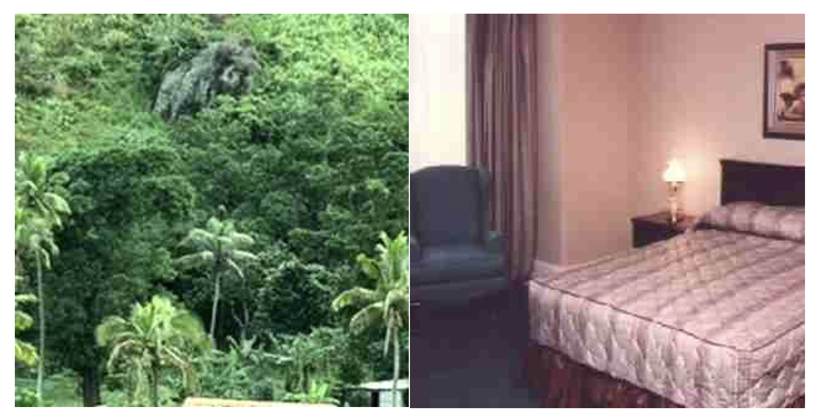

# CS 4391 Spring 2026 — Term Project

**Due Date:** Sunday, May 10th, 2026 — 11:59 PM

---

## Overview

The goal for this project is to combine image processing, feature extraction, clustering and classification methods we have discussed in class to achieve basic scene understanding. Specifically, we will examine the task of scene recognition starting with very simple methods — small-scale images and nearest neighbor classification — and then move on to quantized local features and linear classifiers learned by support vector machines.

For this project, you will be given two sets of images: **Train** and **Test**. In each set of images, you can find a total of 4 categories of images (4 different kinds of scenes). The images are relatively small (all are ~350x250) and colored (.jpeg).

Below are two sample images from the sets: (left) An outdoor scene in the forest; (right) An indoor scene of a bedroom.

---

## Project Requirements

### 1. Pre-processing

For **all** training images, do the following:

- **a.** Convert to grayscale images, and adjust the brightness if necessary (e.g. if average brightness is less than 0.4, increase brightness; if average brightness is greater than 0.6, reduce brightness).
- **b.** Resize the image to **two** different sizes: 200x200 and 50x50, and save them.

### 2. Feature Extraction — SIFT

Extract SIFT features on **all** training images and save the data.

### 3. Feature Extraction — Histogram

Extract Histogram features on **all** training images and save the data.

### 4. Training

Perform the following **four** training methods on the data:

- **a.** Represent the image directly using the 50x50 (2500) pixel values and use the Nearest Neighbor classifier.
- **b.** Represent the image using SIFT feature data and use Nearest Neighbor classifier.
- **c.** Represent the image using Histogram feature data and use Nearest Neighbor classifier.
- **d.** Train the images (200x200) using CNN (you can choose any conv/relu layer and number of parameters for the fully connected layer).

### 5. Testing & Results

Test the **four** trained classifiers using **all** test images and report the following results:

- **a.** Percentage of correctly classified images in the test set.
- **b.** Percentage of False Positive (images that are falsely classified).
- **c.** Percentage of False Negative (images that are not classified).

### 6. Write-Up

Please generate a concise report for the project. In the report:

- Describe how you implemented the project.
- Report the results from Step 5.
- Briefly analyze and discuss the results (e.g., comparisons, why one method performs better than the other).
- Include any other findings (e.g., what affected the accuracy).

---

## Submission Instructions

Please submit your source code and report to eLearning **only**.
